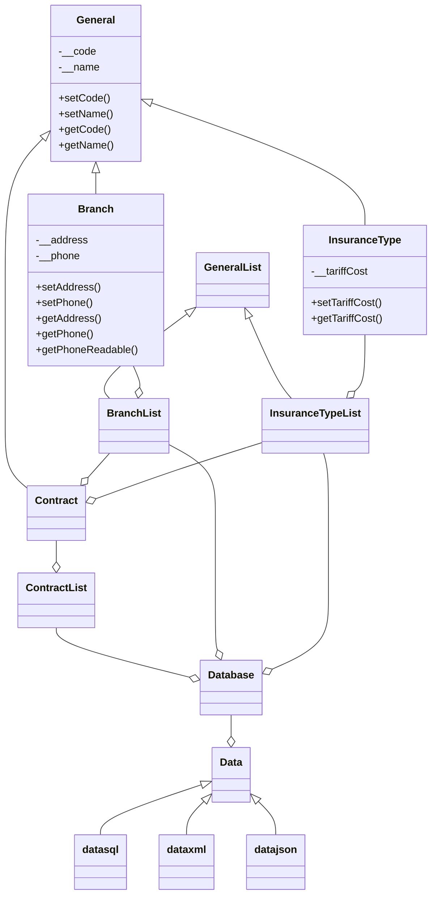

```mermaid
classDiagram

class General{
  - __code
  - __name
  + setCode()
  + setName()
  + getCode()
  + getName()
  + getItems()
}

class Branch{
  - __address
  - __phone
  + setAddress()
  + setPhone()
  + getAddress()
  + getPhone()
  + getPhoneReadable()
}

class InsuranceType{
  - __tariffCost
  + setTariffCost()
}

class GeneralList{
  - __list
  + clear()
  + getCodes()
  + findByCode()
  + getNewCode()
  + appendItem()
  + createItem()
  + newItem()
  + removeItem()
}

class BranchList{
  + appendItem()
  + createItem()
  + newItem()
  + removeItem()
  + getAddress()
  + getPhone()
  + getPhoneReadable()
}

class InsuranceTypeList{
  + appendItem()
  + createItem()
  + newItem()
  + removeItem()
  + getTariffCost()
}

class Contract{
  - __date
  - __total
  - __tariff
  - __branch
  - __insuranceTypes
  + setDate()
  + setTariff()
  + setBranch()
  + appendInsuranceType()
  + removeInsuranceType()
  + setInsuranceTypes()
  + calculateTotal()
  + clearInsuranceTypes()
  + appendBranch()
  + removeBranch()
  + getDate()
  + getTotal()
  + getTariff()
  + getTariffTotal()
  + getBranch()
  + getInsuranceTypes()
  + getShortDescription()
  + getDescription()
}

class ContractList{
    + appendItem()
    + createItem()
    + newItem()
}

class Database{
    - __contractList
    - __branchList
    - __insuranceTypeList
    + clear()
    + createBranch()
    + newBranch()
    + removeBranch()
    + getBranch()
    + getBranchList()
    + getBranchCodes()
    + getBranchNewCode()
    + createInsuranceType()
    + newInsuranceType()
    + removeInsuranceType()
    + getInsuranceType()
    + getInsuranceTypeList()
    + getInsuranceTypeCodes()
    + getInsuranceTypeNewCode()
    + createContract()
    + newContract()
    + removeContract()
    + getContract()
    + getContractList()
    + getContractCodes()
    + getContractNewCode()
}

class Data{
    + __database
    + __input
    + __output
    + setDatabase()
    + setInput()
    + setOutput()
    + getDatabase()
    + getInput()
    + getOutput()
    + readFile()
    + writeFile()
    + read()
    + write()
}

class datasql{
  + read()
  + write()
}

class dataxml{
  + read()
  + write()
}

class datajson{
  + read()
  + write()
}


General <|-- Branch
General <|-- Contract
General <|-- InsuranceType
GeneralList <|-- BranchList
Branch --o BranchList
BranchList --o Contract
GeneralList <|-- InsuranceTypeList
InsuranceType --o InsuranceTypeList
InsuranceTypeList --o Contract

Contract --o ContractList
ContractList --o Database
BranchList --o Database
InsuranceTypeList --o Database
Database --o Data
Data <|-- datasql
Data <|-- dataxml
Data <|-- datajson
```

# Система управления страховой компанией


## О проекте
Данный проект был разработан в рамках курса "Объектно-ориентированное программирование" в 3-м семестре обучения на направлении "Прикладная математика и информатика" механико-математического факультета Саратовского государственного университета имени Н.Г. Чернышевского (СГУ).
Проект демонстрирует практическое применение принципов ООП для решения бизнес-задачи по управлению информационной системой страховой компании. В процессе разработки были использованы ключевые концепции объектно-ориентированного проектирования, такие как наследование, инкапсуляция, полиморфизм и абстракция.
Система предоставляет комплексное решение для управления страховыми договорами, работы с клиентами и филиалами компании, а также для ведения учета различных типов страховых продуктов, реализуя все необходимые бизнес-процессы страховой компании в рамках учебной задачи.

## Обзор проекта

Данный репозиторий содержит объектно-ориентированную систему для управления операциями страховой компании. Система спроектирована с учетом возможности расширения и удобства поддержки, с использованием шаблонов наследования и композиции для создания гибкой архитектуры управления страховыми договорами, филиалами и различными типами страхования.

## Архитектура системы

Система построена на нескольких ключевых компонентах, работающих вместе:

### Основные компоненты

- **Класс General**: Базовый класс, обеспечивающий основную функциональность для всех сущностей в системе
- **Управление филиалами**: Обрабатывает информацию о филиалах компании и контактных данных
- **Управление типами страхования**: Управляет различными видами страховых продуктов с их тарифными ставками
- **Управление договорами**: Создает и поддерживает страховые договоры, связывающие клиентов, филиалы и типы страхования
- **Управление базой данных**: Централизует операции с данными по всей системе

### Хранение данных

Система реализует гибкий подход к хранению данных через:

- **Хранение в XML**: Полная поддержка сохранения и загрузки данных в формате XML
- **База данных SQLite**: Хранение в реляционной базе данных с правильными ограничениями внешних ключей
- **Расширяемый слой данных**: Абстрактный класс Data позволяет легко реализовать дополнительные форматы хранения

## Диаграмма классов



## Ключевые особенности

- **Объектно-ориентированный дизайн**: Комплексная реализация принципов ООП
- **Варианты хранения данных**: Несколько серверных частей хранения (XML, SQLite)
- **Чистая архитектура**: Разделение задач с отдельными слоями для доступа к данным и бизнес-логики
- **Строгая типизация**: Проверка типов для всех операций для обеспечения целостности данных

## Техническая реализация

### Схема базы данных

Схема базы данных SQLite включает таблицы для:
- `branch`: Хранит информацию о филиалах с контактными данными
- `insurance_type`: Содержит определения страховых продуктов и их стоимость
- `contract`: Управляет клиентскими договорами
- `contract_insurance_type`: Таблица связи для отношений договор-тип страхования
- `contract_branch`: Таблица связи для отношений договор-филиал

### Организация кода

- **Классы сущностей**: Определяют основные бизнес-объекты (Branch, InsuranceType, Contract)
- **Классы коллекций**: Управляют операциями над группами сущностей (BranchList, InsuranceTypeList, ContractList)
- **Слой доступа к данным**: Абстрагирует операции хранения (Data, datasql, dataxml)
- **Слой бизнес-логики**: Реализует бизнес-правила и расчеты (Contract, Database)

## Начало работы

### Предварительные требования

- Python 3.x
- SQLite3 (входит в стандартную библиотеку Python)

### Установка

1. Клонируйте этот репозиторий:
```bash
git clone https://github.com/yourusername/insurance-management-system.git
cd insurance-management-system
```

2. Дополнительные зависимости не требуются, так как система использует стандартные библиотеки Python.

### Примеры использования

#### Создание и управление филиалами

```python
from branchlist import BranchList
from branch import Branch

# Создание списка филиалов
branch_list = BranchList()

# Добавление нового филиала
new_branch = Branch(branch_list.getNewCode(), "Центральный офис", "ул. Ленина, 123", 74951234567)
branch_list.appendItem(new_branch)

# Форматирование номера телефона для отображения
print(new_branch.getPhoneReadable())  # +7 (495) 123-4567

# Поиск филиала по коду
found_branch = branch_list.findByCode(0)
print(found_branch.getAddress())  # "ул. Ленина, 123"
```

#### Создание страховых договоров

```python
from database import Database

# Инициализация базы данных
db = Database()

# Создание филиалов и типов страхования
branch = db.newBranch("Городской филиал", "пр. Мира, 42", 74959876543)
insurance_type1 = db.newInsuranceType("Страхование имущества", 500)
insurance_type2 = db.newInsuranceType("Медицинское страхование", 750)

# Создание нового договора
contract = db.newContract(
    "Иванов Иван Иванович", 
    "01.05.2025", 
    1000,  # Базовый тариф
    [branch],  # Связанные филиалы
    [insurance_type1, insurance_type2]  # Выбранные типы страхования
)

# Вывод деталей договора
print(contract.getDescription())
```

#### Сохранение и загрузка данных

```python
from database import Database
from dataxml import dataxml
from datasql import datasql

# Создание базы данных и заполнение данными
db = Database()
# ... добавление филиалов, типов страхования, договоров ...

# Сохранение в XML
xml_data = dataxml(db, '', 'insurance_data.xml')
xml_data.write()

# Сохранение в SQLite
sql_data = datasql(db, '', 'insurance_data.sqlite')
sql_data.write()

# Загрузка из XML
new_db = Database()
xml_loader = dataxml(new_db, 'insurance_data.xml', '')
xml_loader.read()
```

## Принципы разработки

Этот проект демонстрирует несколько важных принципов разработки программного обеспечения:

1. **Иерархия наследования**: Использует правильное наследование для повторного использования кода
2. **Инкапсуляция**: Приватные атрибуты с методами getter/setter
3. **Композиция**: Сложные объекты состоят из более простых
4. **Абстракция данных**: Общие интерфейсы для различных реализаций хранения
5. **Единственная ответственность**: Каждый класс имеет конкретную цель и ответственность

## Возможные улучшения

- Добавление поддержки хранения данных в JSON
- Реализация пользовательского интерфейса (CLI или GUI)
- Добавление функций отчетности и аналитики
- Реализация аутентификации и авторизации пользователей
- Добавление модульных тестов для всех компонентов

## Вклад в проект

Вклады приветствуются! Пожалуйста, не стесняйтесь отправлять запросы на внесение изменений (Pull Request).

## Лицензия

Этот проект лицензирован под лицензией MIT — подробности см. в файле LICENSE./xml-поддержка-orange.svg)

## Обзор проекта

Данный репозиторий содержит объектно-ориентированную систему для управления операциями страховой компании. Система спроектирована с учетом возможности расширения и удобства поддержки, с использованием шаблонов наследования и композиции для создания гибкой архитектуры управления страховыми договорами, филиалами и различными типами страхования.

## Архитектура системы

Система построена на нескольких ключевых компонентах, работающих вместе:

### Основные компоненты

- **Класс General**: Базовый класс, обеспечивающий основную функциональность для всех сущностей в системе
- **Управление филиалами**: Обрабатывает информацию о филиалах компании и контактных данных
- **Управление типами страхования**: Управляет различными видами страховых продуктов с их тарифными ставками
- **Управление договорами**: Создает и поддерживает страховые договоры, связывающие клиентов, филиалы и типы страхования
- **Управление базой данных**: Централизует операции с данными по всей системе

### Хранение данных

Система реализует гибкий подход к хранению данных через:

- **Хранение в XML**: Полная поддержка сохранения и загрузки данных в формате XML
- **База данных SQLite**: Хранение в реляционной базе данных с правильными ограничениями внешних ключей
- **Расширяемый слой данных**: Абстрактный класс Data позволяет легко реализовать дополнительные форматы хранения

## Диаграмма классов



## Ключевые особенности

- **Объектно-ориентированный дизайн**: Комплексная реализация принципов ООП
- **Варианты хранения данных**: Несколько серверных частей хранения (XML, SQLite)
- **Чистая архитектура**: Разделение задач с отдельными слоями для доступа к данным и бизнес-логики
- **Строгая типизация**: Проверка типов для всех операций для обеспечения целостности данных
- **Поддержка интернационализации**: Текст поддерживает Unicode для многоязычности

## Техническая реализация

### Схема базы данных

Схема базы данных SQLite включает таблицы для:
- `branch`: Хранит информацию о филиалах с контактными данными
- `insurance_type`: Содержит определения страховых продуктов и их стоимость
- `contract`: Управляет клиентскими договорами
- `contract_insurance_type`: Таблица связи для отношений договор-тип страхования
- `contract_branch`: Таблица связи для отношений договор-филиал

### Организация кода

- **Классы сущностей**: Определяют основные бизнес-объекты (Branch, InsuranceType, Contract)
- **Классы коллекций**: Управляют операциями над группами сущностей (BranchList, InsuranceTypeList, ContractList)
- **Слой доступа к данным**: Абстрагирует операции хранения (Data, datasql, dataxml)
- **Слой бизнес-логики**: Реализует бизнес-правила и расчеты (Contract, Database)

## Начало работы

### Предварительные требования

- Python 3.x
- SQLite3 (входит в стандартную библиотеку Python)

### Установка

1. Клонируйте этот репозиторий:
```bash
git clone https://github.com/yourusername/insurance-management-system.git
cd insurance-management-system
```

2. Дополнительные зависимости не требуются, так как система использует стандартные библиотеки Python.

### Примеры использования

#### Создание и управление филиалами

```python
from branchlist import BranchList
from branch import Branch

# Создание списка филиалов
branch_list = BranchList()

# Добавление нового филиала
new_branch = Branch(branch_list.getNewCode(), "Центральный офис", "ул. Ленина, 123", 74951234567)
branch_list.appendItem(new_branch)

# Форматирование номера телефона для отображения
print(new_branch.getPhoneReadable())  # +7 (495) 123-4567

# Поиск филиала по коду
found_branch = branch_list.findByCode(0)
print(found_branch.getAddress())  # "ул. Ленина, 123"
```

#### Создание страховых договоров

```python
from database import Database

# Инициализация базы данных
db = Database()

# Создание филиалов и типов страхования
branch = db.newBranch("Городской филиал", "пр. Мира, 42", 74959876543)
insurance_type1 = db.newInsuranceType("Страхование имущества", 500)
insurance_type2 = db.newInsuranceType("Медицинское страхование", 750)

# Создание нового договора
contract = db.newContract(
    "Иванов Иван Иванович", 
    "01.05.2025", 
    1000,  # Базовый тариф
    [branch],  # Связанные филиалы
    [insurance_type1, insurance_type2]  # Выбранные типы страхования
)

# Вывод деталей договора
print(contract.getDescription())
```

#### Сохранение и загрузка данных

```python
from database import Database
from dataxml import dataxml
from datasql import datasql

# Создание базы данных и заполнение данными
db = Database()
# ... добавление филиалов, типов страхования, договоров ...

# Сохранение в XML
xml_data = dataxml(db, '', 'insurance_data.xml')
xml_data.write()

# Сохранение в SQLite
sql_data = datasql(db, '', 'insurance_data.sqlite')
sql_data.write()

# Загрузка из XML
new_db = Database()
xml_loader = dataxml(new_db, 'insurance_data.xml', '')
xml_loader.read()
```

## Принципы разработки

Этот проект демонстрирует несколько важных принципов разработки программного обеспечения:

1. **Иерархия наследования**: Использует правильное наследование для повторного использования кода
2. **Инкапсуляция**: Приватные атрибуты с методами getter/setter
3. **Композиция**: Сложные объекты состоят из более простых
4. **Абстракция данных**: Общие интерфейсы для различных реализаций хранения
5. **Единственная ответственность**: Каждый класс имеет конкретную цель и ответственность

## Возможные улучшения

- Добавление поддержки хранения данных в JSON
- Реализация пользовательского интерфейса (CLI или GUI)
- Добавление функций отчетности и аналитики
- Реализация аутентификации и авторизации пользователей
- Добавление модульных тестов для всех компонентов

## Вклад в проект

Вклады приветствуются! Пожалуйста, не стесняйтесь отправлять запросы на внесение изменений (Pull Request).

## Лицензия

Этот проект лицензирован под лицензией MIT — подробности см. в файле LICENSE.
